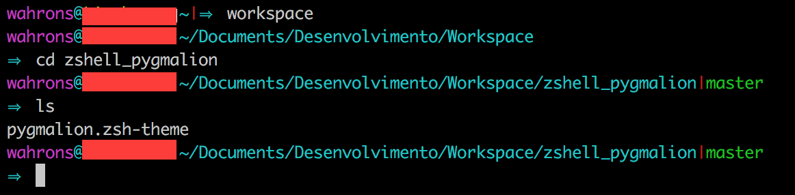

# zshell_pygmalion

### zshell pygmalion theme improved

- The arrow will always appear, and if the length of the prompt is to big it will break to the next line.
- The red pipe will only show if your are in the root or if the folder is a git repository.
- Support for Python Virtualenv

